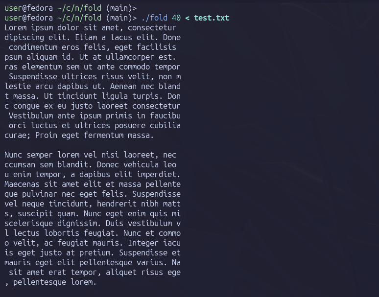

# Simple **fold** util implemented in NASM

Simple **fold** util implemented in [NASM](https://www.nasm.us/)
This project is intended to give me a basic understanding of how assembler works. 
The source file contains comments on the code.



## Instructions

1. Install NASM on your sysem

2. Clone repo and run `make`

```sh
git clone git@github.com:Xenokrat/fold_in_nasm.git
cd fold_in_nasm/
make 
```

3. Use to test on some text file:

```sh
./fold 40 < test.txt
```

4. Clean

Clean output files with:
```sh
make clean
```
